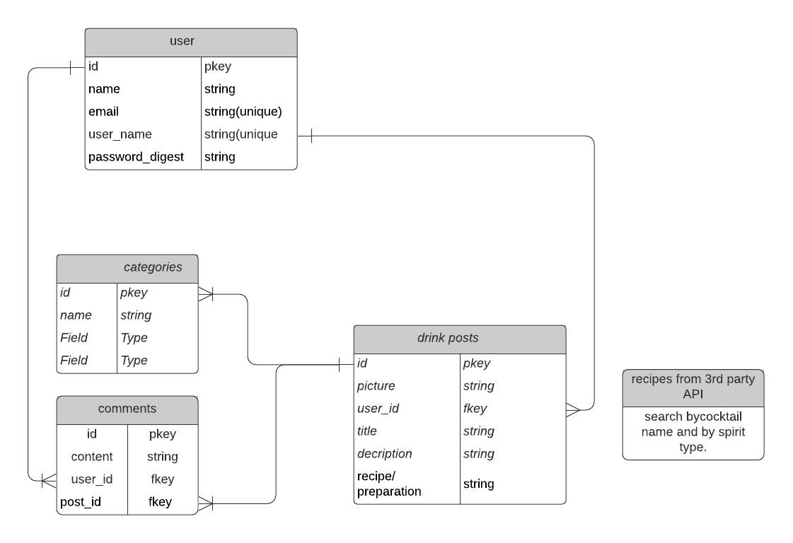

# Cocktail_social
A lovely place to post new  and fun cocktail recipes
# Cocktail Social
### Created by: |Schuyler Luckey| [Github](https://github.com/Gnarlyluck)| [LinkedIn](https://www.linkedin.com/in/schuyler-luckey/) | 
***
### This app is dedicated to sharing your favorite cocktails or sharing your new experiments and getting feedback. Here you can find out what your friends and peers are cooking up behind the bar.  

# To get started here simply:
* Provide your email adress 
* Your name
* Create a User Name and password

## Once you are logged in:
### You can begin exploring what we have to offer. From new experimental cocktails to classic recipes. We are 100% user driven but also offer a full database of classic and modern classic recipes. 
### You can comment on other users posts and let them know how great (or not so great) their cocktails are.
### You can search by posts, by cocktail name, or by spirit. 
***
# Technologies used

- PostgreSQL: used to make the database which stores the Users, Accounts, Posts, and Categories.
- Express: used to access the database from the backend and communicate changes to the Posts (Upvotes and Downvotes)
- React: used with hooks to select whether an animal is cute or not
- Node.js: used throughout the project as the code for it.
# ERD

